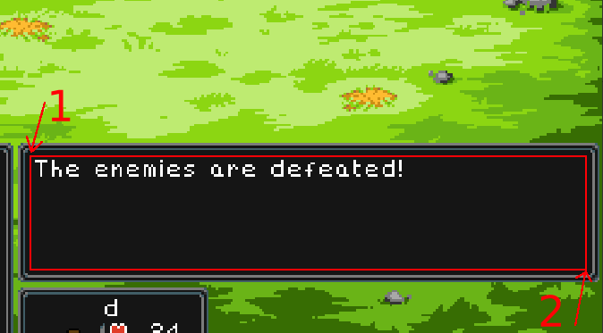

# retrotracker

Uses OCR to watch screen and parse retrommo battle events. Keep track of damage
dealt, gold and exp earned.

Fixing OCR typos with known retrommo names is a work in progres..

## executables
There are 3 executable python scripts for using retrotracker:
1. retrotracker.py - the actual tracker/parser
1. modify.py - queries for editing the database
1. query.py - read-only database queries

## basic usage
1. start by initializing the database: `./modify.py init`
1. create some player stats
    1. use preset stats `./modify create_presets`
    1. or use the interactive tool `./modify add_player`
1. run the tracker `./retrotracker.py start --position "retrommo username" "stats alias"
    1. see note below on positioning
    1. retrommo is whatever name appears on screen text
    1. stats alias was created in step 2 above

## positioning
The OCR needs to read battle, text. Using --position with retrotracker start
will prompt you to input the screen positions. It does this by detecting
your mouse position at two points: top left and bottom right of the text box.

The optimal positioning here will create a rectangle that contains only the
text, and NOT the pixel border around the text. The boarder can mess up text
recognition. See the screenshot below for refernce:

Note: you have to press enter on the terminal before it reads your input.
Use alt-tab since you can't move the mouse until it has read the position!
